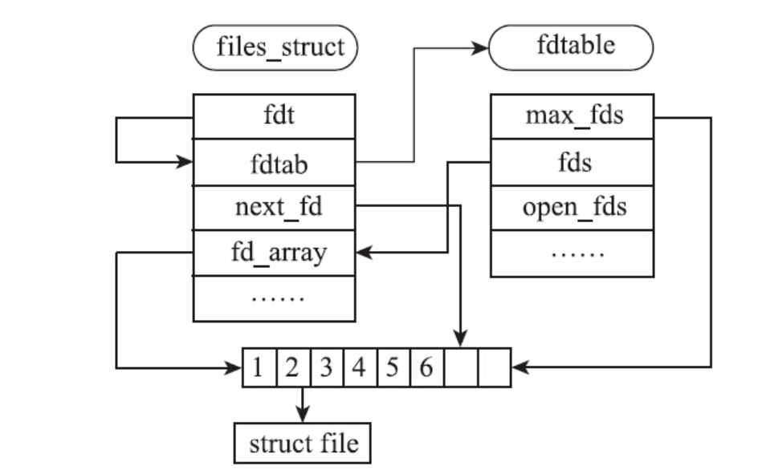

## 一 基础知识

### 1 程序的基本知识

- **一个程序的编译过程**

  - 预处理：处理预处理命令，展开宏等，-E
  - 编译：对源代码语法分析，优化产生汇编代码，-S
  - 汇编：生成目标文件，-o
  - 链接：将各个目标文件（包含库文件）链接成可执行文件

  用`gcc -g -Wall -v hello.c -o hello`可以查看编译过程。

- **程序的构成**

  一个二进制可执行程序的格式一般为 ELF 文件，用 `readelf` 命令可查看其 ElF 格式。

  - .text段：代码段，存储可执行指令
  - .data段：保存非 0 初始值的全局变量和静态变量
  - .bss段：保存没有初始值或者初始值为 0 的全局变量或静态变量，程序加载时，bss段中的变量被初始化为 0，不占物理内存
  - .debug段：保存调试信息
  - .dynamic段：保存动态链接信息
  - .fini段：保存进程退出时的执行程序
  - .init段：保存进程启动时的执行程序
  - .rodata段：用于保存只读数据，如字符串常量，const 修饰的全局变量
  - .symtab段：用于保存符号表

- **系统调用**

  系统调用：用户空间和内核空间的接口（权限不同）

  ==用户空间的程序默认是通过栈来传递参数==的，而==系统调用的参数只能通过寄存器的方式传递==，因为用户态和内核态使用的是不同的栈
  
  - C 库函数：Linux 下使用的 C 库是封装了系统调用的 glibc
  - 线程安全：多线程下安全执行，使用局部变量或资源，利用锁等同步机制来实现全局变量或资源的串行访问
  
- **阻塞与非阻塞**

  Linux 环境下，所有的 I/O 系统调用默认为阻塞

  - 阻塞：当进行系统调用时，除非出错，进程会一直陷入内核态直到调用完成
  - 非阻塞：无论 I/O 操作成功与否，系统调用都会立刻返回

- **同步与异步**

  Linux 环境下的同步非同步指的是 I/O 操作，强调的是 I/O 数据的复制工作是否同步执行

### 2 文件 I/O

广义的文件是 Linux 管理的所有对象，这些对象利用 VFS 机制，以文件系统的形式挂载在内核中

进程中对应的结构是 `task_struct`，进程的文件表保存在`task_struct->files`中

初始状态的 files_struct、fdtable、files的关系如下所示：



#### 1 文件操作

- **打开文件（open）**

  ```c
  int open(const char *pathname, int flags);
  int open(const char *pathname, int flags, mode_t mode);
  // flag：常用的有O_RDONLY、 O_WRONLY和O_RDWR，创建文件O_CREAT
  // 通过 glibc 的变参函数 open 实现系统调用二
  ```

  打开文件主要消耗**文件描述符**和**内核管理文件结构file**

- **关闭文件（close）**

  遗忘 close 会导致：

  - 文件描述符没有被释放（是有限的）
  - 用于文件管理的内存结构没有释放

  Linux文件描述符策略永远选择最小的可用的文件描述符

- **文件偏移（lseek）**

  ```c
  off_t lseek(int fd, off_t offset, int whence);
  // 将 fd 的文件偏移量设置为以 whence 为起点、偏移为 offset 的位置
  // whence：SEEK_SET、 SEEK_CUR和SEEK_END
  ```

- **读取文件（read）**

  ```c
  ssize_t read(int fd, void *buf, size_t count);
  // read尝试从fd中读取count个字节到buf中， 并返回成功读取的字节数， 同时将文件偏移向前移动相同的字节数。
  ```

- **写入文件（write）**

  ```c
  ssize_t write(int fd, const void *buf, size_t count);
  // write尝试从buf指向的地址， 写入count个字节到文件描述符fd中， 并返回成功写入的字节数， 同时将文件偏移向前移动相同的字节数
  ```

- **文件描述符的复制（dup）**

  ```c
  int dup(int oldfd);
  int dup2(int oldfd, int newfd);
  int dup3(int oldfd, int newfd, int flags);
  // dup会使用一个最小的未用文件描述符作为复制后的文件描述符
  // dup2是使用用户指定的文件描述符newfd来复制oldfd的
  ```

- **文件数据同步（sync）**

  ```c
  void sync(void);
  int fsync(int fd);
  int fdatasync(int fd);
  // sync：阻塞调用
  // fsync：只同步fd指定的文件， 并且直到同步完成才返回
  // fdatasync：只同步文件的实际数据内容， 和会影响后面数据操作的元数据
  ```

- **文件元数据**

  其包括文件的访问权限、 上次访问的时间戳、 所有者、 所有组、 文件大小等信息

  ```c
  int stat(const char *path, struct stat *buf); // 得到指定路径文件基本信息
  int fstat(int fd, struct stat *buf);  // 得到文件描述符 fd 指定文件信息
  int lstat(const char *path, struct stat *buf);  // 与stat基本同，当path为链接时得到链接文件自己本身的基本信息
  ```

  

## 二 Linux线程

### 1 pthread库函数借口

| POSIX函数                                       | 函数功能                     |
| ----------------------------------------------- | ---------------------------- |
| `phtread_create`                                | 创建一个线程                 |
| `pthread_exit`                                  | 退出线程                     |
| `pthread_self`                                  | 获取进程ID                   |
| `pthread_equal`                                 | 检查两个线程ID是否相等       |
| `pthread_join`                                  | 等待进程退出                 |
| `pthread_detach`                                | 设置进程状态为分离状态       |
| `phtread_cancel`                                | 线程取消                     |
| `pthread_cleanup_push<br />pthread_cleanup_pop` | 线程退出，清理函数注册和执行 |

- `pthread_create`

  ```c
  #include <pthread.h>
  int pthread_create(pthread_t *restrict thread,
                     const pthread_attr_t *restrict attr,
                     void *(*start_routine)(void*),
                     void *restrict arg);
  ```

  - thread：pthread_t 类型的指针，线程创建成功将分配的线程ID填入该指针指向的地址
  - attr:pthread_attr_t 类型的指针，可设置线程的属性，比如指定新建线程栈的大小，调度策略
  - 第三个参数是线程需要执行的函数，线程创建成功后该线程会执行`start_routine`函数，相当于`main`
  - arg：新建线程执行的`start_routine`函数的入参
  - 成功返回0，不成功返回错误码

- 线程退出的情况

  - 创建线程时的`start_routine`函数执行了 return，并且指定返回值
  - 线程调用 `pthread_exit`
  - 其他线程调用了`pthread_cancel`函数取消了该线程

  

- `pthread_join`

  用于线程的连接，等待某线程的退出并接收它的返回值

  ```c
  #include <pthread.h>
  int pthread_join(pthread_t thread, void **retval);
  ```

  - 等待的线程尚未退出， 那么`pthread_join`的调用线程就会陷入阻塞。
  - 等待的线程已经退出， 那么`pthread_join`函数会将线程的退出值（void*类型） 存放到retval指针指向的位置
  - 可连接状态的线程退出后， 需要对其执行连接操作， 否则线程资源无法释放，从而造成资源泄漏。

  

- `pthread_detach`

  用于线程的分离，线程退出的时候系统自动将线程相关的资源释放掉，无需等待连接

  ```c
  #include <pthread.h>
  int pthread_detach(pthread_t thread);
  ```

  - 如果线程处于已分离的状态， 那么线程退出时， 系统将负责回收线程的资源